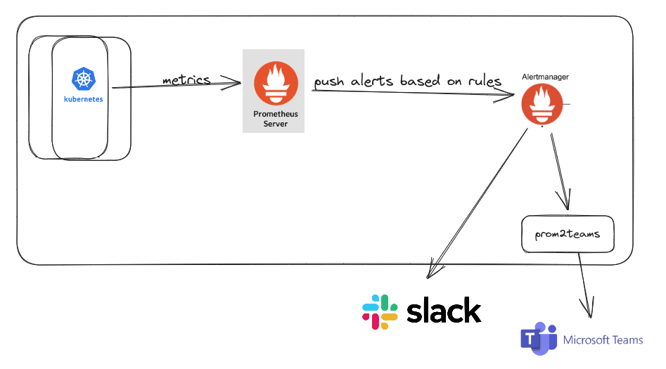

### 1. Add rules 
```kubectl apply -f custom-rules.yaml```

### 2. Upgrade helm chart:
```helm upgrade prometheus prometheus-community/kube-prometheus-stack -n monitoring -f values-kube-prom-stack.yaml```

### 3.  Restart the Alertmanager
```kubectl delete pod alertmanager-prometheus-kube-prometheus-alertmanager-0 -n monitoring```

### 4 Notifications via slack

   Add your webhook url in to the values-kube-prom-stack.yaml:
```
  slack_api_url: '<add-your-web-hook-url>'
```

   Upgrade helm chart:
   
```helm upgrade prometheus prometheus-community/kube-prometheus-stack -n monitoring -f values-kube-prom-stack.yaml```


### 4 Notifications via MS Teams

### 4.1.  MS Teams Configuration    
   
Uncomment the following lines to receive notifications via MS Teams in values-kube-prom-stack.yaml:

```
    #- name: 'msteams-notifications'
    #  webhook_configs:
    #    - url: "http://prom2msteams-prom2teams:8089/v2/Connector"  
```

   Change slack-notifications to msteams-notifications the lines below in values-kube-prom-stack.yaml:
```
      receiver: 'slack-notifications' # default receiver
      routes:
      - receiver: 'slack-notifications'
```      

   Upgrade helm chart:
   
```helm upgrade prometheus prometheus-community/kube-prometheus-stack -n monitoring -f values-kube-prom-stack.yaml```


### 4.2.  Install Prom2MS 

Prom2MS is an HTTP server that receives alert notifications from a previously configured Prometheus Alertmanager instance and forwards it to MS Teams using defined connectors)

4.2.1. ```git clone https://github.com/idealista/prom2teams.git```

4.2.2. ```cd prom2teams```

4.2.3. Change the default MS Teams' message template (prom2teams/helm/files/teams.j2) with the one below:
```
{
    "@type": "MessageCard",
    "@context": "http://schema.org/extensions",
    "summary": "{{ msg_text.summary }}",
    "title": "Prometheus alert",
    "sections": [{
        "activityTitle": "{{ msg_text.summary }}",
        "facts": [{
            "name": "Alert",
            "value": "{{ msg_text.name }}"
        },{
            "name": "Description",
            "value": "{{ msg_text.description }}"
        },{
            "name": "Severity",
            "value": "{{ msg_text.severity }}"
        },{
            "name": "In host",
            "value": "{{ msg_text.instance }}"
        },],
          "markdown": true
    }]
}
```


4.2.4    Add your webhook url in to the values-prom2msteams.yaml:
```
  connector: '<add-your-web-hook-url>'
```

4.2.5 Install Prom2MS helm chart

```helm install prom2msteams helm -n monitoring -f ../prometheus-alert-demo/values-prom2msteams.yaml```

Note: The folder structure is below (have a root folder named "test")

```---- test```

```-------- prometheus-alert-demo```

```-------- prom2teams```

```------------ helm```

```---------------- files```

```-------------------- teams.j2```

### 5. Prometheus UI

kubectl port-forward svc/prometheus-operated 9090 -n monitoring

Then open a browser and access the dashboard with the address below:

http://localhost:9090/alerts

### 6. Alert Manager UI

kubectl port-forward -n monitoring alertmanager-prometheus-kube-prometheus-alertmanager-0 9093:9093

http://localhost:9093/#/alerts


### Resources:
1. https://github.com/mehmetmgrsl/k8s-prometheus-grafana
2. https://github.com/idealista/prom2teams
3. https://prometheus.io/docs/tutorials/alerting_based_on_metrics/
4. https://samber.github.io/awesome-prometheus-alerts/rules.html
5. https://www.weave.works/blog/labels-in-prometheus-alerts-think-twice-before-using-them